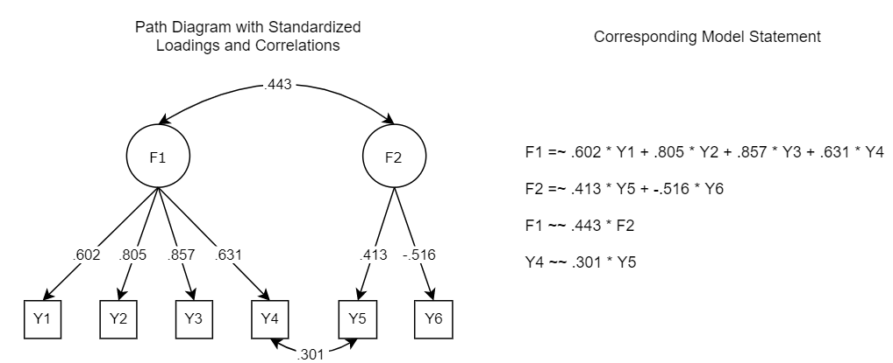

```{r setup, include=FALSE}
knitr::opts_chunk$set(echo = FALSE)


library(rmarkdown)
library(lavaan)
library(tidyverse)
library(simstandard)
library(shiny)
library(shinythemes)
library(flexdashboard)
library(knitr)
library(tools)
library(patchwork)
library(shinybusy)
library(purrr)
library(stringr)
library(shinyjs)

# Install dynamic package from GitHub
library(devtools)
devtools::install_github("melissagwolf/dynamic")
library(dynamic)

#List aesthetics first
```

<style type="text/css">

body {
  font-family: Palatino;
}

.shiny-output-error-validation {
        color: #ff0000;
      }

</style>

<!-- Search Engine Optimization -->
<html>
<head>
<title>Dynamic Fit Index Cutoffs for CFA Models</title>

<meta name="description" content="Derive dynamic fit index cutoffs that are adaptively tailored to the specific factor model and data being evaluated."/>
</head>
</html>

<!-- Global site tag (gtag.js) - Google Analytics -->
<script async src="https://www.googletagmanager.com/gtag/js?id=UA-167733193-2"></script>
<script>
  window.dataLayer = window.dataLayer || [];
  function gtag(){dataLayer.push(arguments);}
  gtag('js', new Date());

  gtag('config', 'UA-167733193-2');
</script>

```{r design}
fluidPage(theme = shinytheme("slate"),
          shinybusy::add_busy_bar(color = "#BECEE4"))

#library(shiny)

options(shiny.sanitize.errors = FALSE)
```

Sidebar {.sidebar data-width=400}
=====================================

This app uses Monte Carlo simulations to generate dynamic fit index cutoff values for multi-factor models.

\  

```{r inputs}
shinyjs::useShinyjs(rmd = TRUE)

selectInput("input_type", 
            label = "Do you want to upload a dataset or enter your model statement with factor loadings?",
            choices = list(" "=1,
                           "Upload data" = 2,
                           "Enter model manually" = 3))

checkboxInput("autodl", label = "Download results automatically", value = FALSE)

conditionalPanel(
  condition = "input.input_type == 2",
  fileInput("dataset", label = "Upload your dataset",
            placeholder = ".csv file",
            accept = ".csv"),

  # Create text box for users to enter analysis model
  textAreaInput(
    inputId = "model_syntax",
    label = "Input Model Statement (no factor loadings):",
    value = "F1 =~ Y1 + Y2 + Y3 + Y4
F2 =~ Y5 + Y6
F1 ~~ F2
Y4 ~~ Y5", 
    
    # Allow users to resize text box
    resize = "both", rows = 12, cols = 100),

  helpText("Please view the path diagram to make sure your model is correct."),

  tags$a(href = "#section-modelcheck",
  shiny::actionButton("check", "Model Check")   # need a different button here for flow later
       ))

conditionalPanel(
  condition = "input.input_type == 3",
  numericInput("sampsize", "Input Sample Size", value=NULL),

  # Create text box for users to enter analysis model
  textAreaInput(
    inputId = "model_syntax_loadings",
    label = "Input Model Statement with factor loadings:",
    value = "F1 =~ .602*Y1 + .805*Y2 + .857*Y3 + .631*Y4
F2 =~ .413*Y5 + -.516*Y6
F1 ~~ .443*F2
Y4 ~~ .301*Y5", 
    
    # Allow users to resize text box
    resize = "both", rows = 12, cols = 100),

  helpText("Please view the path diagram to make sure your model is correct."),

  tags$a(href = "#section-modelcheck",
  shiny::actionButton("check2", "Model Check")   # need a different button here for flow later
       ))

conditionalPanel(
  condition = "input.check > 0 | input.check2 > 0",
  
  helpText("This may take a few minutes.
         Please only press submit once."),
  
  tags$a(href = "#section-results",
       shiny::actionButton("go", "Submit")),
  
  #downloadButton('download','Download DFI Cutoffs')
)

```

```{r rename}
#Name inputs
dl <- eventReactive(input$go,{input$autodl})

type <- eventReactive(input$go,{input$input_type})
type_mc <- eventReactive(input$check,{input$input_type})
type_mc2 <- eventReactive(input$check2,{input$input_type})

dataset <- eventReactive(input$go,{input$dataset})
dataset_mc <- eventReactive(input$check,{input$dataset})
model <- eventReactive(input$go,{input$model_syntax})
model_mc <- eventReactive(input$check,{input$model_syntax})

n <- eventReactive(input$go,{input$sampsize})
n_mc <- eventReactive(input$check2,{input$sampsize})
model_loadings <- eventReactive(input$go,{input$model_syntax_loadings})
model_loadings_mc <- eventReactive(input$check2,{input$model_syntax_loadings})
```

```{r}
# Check the model statement for data upload option

model_check <- eventReactive(input$check,{
  
  if(type_mc()==2){
    
    df <- read.csv(dataset_mc()$datapath)
    fit <- lavaan::cfa(model = model_mc(), data = df)
    mc <- semPlot::semPaths(fit)
    return(mc)
    
  }
})

# Check the model statement for manual entry option

model_check2 <- eventReactive(input$check2,{
  if(type_mc2()==3){
    dat <- simstandard::sim_standardized(m = model_loadings_mc(),
                                         n = n_mc(),
                                         latent=FALSE,
                                         errors=FALSE)
    mod <- simstandard::fixed2free(model_loadings_mc())
    fit <- lavaan::cfa(model=mod,data=dat,std.lv=TRUE)
    mc <- semPlot::semPaths(fit)
    return(mc)
  }
})
```

```{r}
# Run the DFI function from dynamic

package_results <- eventReactive(input$go,{
  
  if(type()==2){
    
    df <- read.csv(dataset()$datapath)
    fit <- lavaan::cfa(model = model(), data = df)
    dynamic_fit <- dynamic::cfaHB(fit, reps = 20)
    return(dynamic_fit)
  }
  
  if(type()==3){

    dynamic_fit <- dynamic::cfaHB(model = model_loadings(),
                                  n = n(),
                                  manual = T,
                                  reps = 20)

    return(dynamic_fit)
  }
  
})
```


Multi-factor CFA
=====================================  

Row {.tabset}
-----------------------------------------------------------------------

### Instructions

```{r}
renderUI({
  input_type <- input$input_type
  if (input_type == 1) {
    HTML(
    '<div style="font-weight: bold;">Welcome to dynamic!</div> 
    <br>
    You can now compute tailored cutoffs by uploading your dataset or entering your model statement with factor loadings. Select your prefered option on the left. More instructions will follow.
    <br>
    <br>
    <b>Note</b>: These cutoff values are currently only accurate for **single level** models using **ML estimation**.  Any cutoff values produced for bi-factor models, higher-order models, or models estimated using WLSMV are inaccurate (you will likely get an error message if you try to compute them).
    ')
  } else if (input_type == 2) {
    HTML('<div style="font-weight: bold;">How to calculate cutoffs by uploading your data</div>
         <br>
         <i>This is the easier option.</i>
         <br>
         <br>
         <ol type = "1">
            <li> Upload your dataset </li>
              <ul>
                <li> It must be a .csv file </li>
                <li> The data must have the variable names at the top of the file </li>
                <li> Variable names must begin with a letter and have no spaces or special characters </li>
              </ul>
            <li> Enter the model statement </li>
              <ul>
                <li> The observed variables in the model statement must match the variable names in the dataset </li>
                <li> Factor loadings are denoted by = ~ </li>
                <li> Correlations are denoted by ~ ~ </li>
                <li> Do not enter the magnitude of the factor loadings in the model statement </li>
              </ul>
            <li> The app will run your model and extract the factor loadings. It will use this to calculate your tailored cutoff values. </li>  
         </ol>
         <br>
    See an example of a model statement and a corresponding path diagram below.
    <div></div>')
  } else if (input_type == 3){
    text <- HTML('
    <div style="font-weight: bold;">How to enter your model statement manually</div>
    <br>
    <i>This is a good option if you do not have the data or do not want to upload it.</i>
    <br>
    <br>
    <ol type = "1">
      <li> Input your sample size </li>
      <li> For the  model statement, enter your model\'s <b>standardized</b>  factor loadings, factor correlations (if any), and residual correlations (if any).</li>
        <ul>
          <li>Factor loadings are denoted by = ~ </li>
          <li>Correlations are denoted by ~ ~ </li>
          <li>Enter the magnitude of the relationship first</li>
        </ul>
      <li> You can drag the textbox to resize it to make it easier to read your model statement.</li>
      <li> When the simulations are complete, the results will appear in the <b>Results</b> and <b>Plots</b> tabs.</li>
    </ol>
    <br>
    See an example of a model statement and a corresponding path diagram below.
    <div></div>
    ')
    img_tag <- htmltools::tags$img(src = "Example3.png")
    combined_html <- htmltools::div(
    img_tag,
    text
  )
  
  combined_html

  }
})

```

<div>
```{r progress1, eval=FALSE}
#Just added because of a shiny bug with the action button
#Ignore

renderPlot({
  
    shiny::validate(
    shiny::need(length(orthogonal(model()$datapath)) != 0,
                       "Did you mean to enter an orthogonal model? If so, please manually set orthogonal factors to have a zero correlation in your model statement (e.g., F1 ~~ 0*F2)."))
  
    shiny::validate(
    shiny::need(modelerror(model()$datapath) != 1,
                "It looks like there might be an error in your model statement. Common errors include: an extra decimal, a missing asterisk, or a missing plus sign. Please inspect your model statement."))
  
    shiny::validate(
    shiny::need(missing_plus(model()$datapath)==0,
                "I think you forgot to include a plus sign in your model statement.  Please inspect your model statement.  This is an experimental error message.  Please email melissagordon@ucsb.edu if you believe this error message is incorrect."))

  shiny::validate(
          shiny::need(tools::file_ext(model()$name) %in% 
                 c('text','.txt','txt'),
               "You must enter a text file (.txt)"))
  
  shiny::validate(
    shiny::need(number_factor(model()$datapath)>1,
                "You entered a one-factor model. Go back to the main page and select the one-factor CFA application."))

  shiny::validate(
    shiny::need(unstandardized(model()$datapath)==0,
    "One of your loadings or correlations has an absolute value of 1 or above (an impossible value). Please use standardized loadings. If all of your loadings are under 1, try looking for a missing decimal somewhere in your model statement."))
  
  shiny::validate(
    shiny::need(defre(model()$datapath,n())>1,
                "It is impossible to add misspecifications to a just identified model."))
  
  shiny::validate(
    shiny::need(nrow(multi_factor_num(model()$datapath))>(number_factor(model()$datapath)-1),
                     "There are not enough free items to produce all misspecification levels."))
  
  invisible(multi_df() %>% 
    unlist())
  
}, width=1,height=1)
```
</div>

### Model Check {#modelcheck}

Check the path diagram below to make sure your model was entered correctly. After you are done, press "Submit" to calculate your DFI cutoffs.

```{r}
# Display the plot in the app

renderPlot({
  
  if (input$input_type == 2) {
    model_check()
    }
  
  else if (input$input_type == 3){
    model_check2()
  }
})

# This is for the PDF report 

model_check_pdf <- reactive({
  if (input$input_type == 2) {
    model_check()
    }
  
  else if (input$input_type == 3){
    model_check2()
  }  
})

# Model Statement is for the PDF report 

model_pdf <- reactive({
  if (input$input_type == 2) {
    model()
    }
  
  else if (input$input_type == 3){
    model_loadings()
  }  
})
```

### Results {#results}

These are the dynamic model fit index cutoff values for your model:

<div>
```{r fit-table}
# Generate dynamic model fit index cutoffs and table in the app
renderTable({
  
  package_results()$cutoffs
  
  },
    digits=3, align='c', rownames = TRUE, width="auto",
    bordered = TRUE) 

#########################
####### Download ########
#########################

# Create object for PDF report
cutoffs_pdf <- reactive({package_results()$cutoffs})

# Tell shinyjs that there is a disabled button called download results which is hidden in renderUI
shinyjs::disabled(downloadButton('download','Download DFI Cutoffs'))

# Display the download button when the simulation finishes
renderUI({
  
  if(!is.null(package_results()$cutoffs)){
    shinyjs::enable("download")
  }
  
  })

# Update report template with results
  
output$download <- downloadHandler(
    filename = paste0("DFI Cutoffs - ", Sys.Date(), ".pdf"),
    content = function(f) {
      # Create a new empty environment
      # This allows us to pass in only the relevant variables into the report
      e <- new.env()
      # Add the cutoffs
      e$cutoffs <- cutoffs_pdf()
      # Add the model image
      e$model_check <- model_check_pdf()
      e$input_text <- model_pdf()
      # Render the document using template saved in same folder
      rmarkdown::render('template-cfahb.Rmd',
                        output_format = rmarkdown::pdf_document(),
                        output_file=f,
                        envir = e)
    }
  )
```

```{r}
# Auto download for those that toggled on the auto download button 
# Need to use shinyjs::delay()
observeEvent(input$go,{
  if(!is.null(cutoffs_pdf) && dl()==TRUE){
    shinyjs::delay(5, shinyjs::click("download")
    )
  } 
})
```


</div>

\  

**Levels**

Goodness of fit indices can be used *as one piece of evidence of validity* to gauge if your model's misspecifications are trivial or substantial.  You will see a level of misspecification severity for each F-1 factor (where F is the number of factors), in accordance with the procedure established by Hu & Bentler in 1999.  

Hu & Bentler derived their cutoff values from a 3 factor model with 15 items, a range of loadings from .7 - .8, and a range of sample sizes from 250 - 5000.  The cutoff values outputted for **Level 1** are the Hu & Bentler equivalent for *your* particular model.  In other words, if Hu & Bentler had used *your* model to generate cutoff values, these are the cutoff values they would have published.  

Your area(s) of concern may differ from the misspecifications simulated here.  You should also consult the residual correlation matrix for local areas of strain, check out the modification indices, and present other types of evidence of validity (such as an evaluation of participants' response processes).

**Rows**

Within each level, there are two rows.

- The first row of the table represents the ideal cutoff values for that misspecification level.  At this cutoff value, 95% of misspecified models will be correctly rejected, while only 5% of correctly specified models will be incorrectly rejected.  This value is best equipped to distinguish between a well-fitting and misspecified model.

- The second row of the table represents acceptable cutoff values for that misspecification level.  At this cutoff value, 90% of misspecified models will be correctly rejected, while 10% of correctly specified models will be incorrectly rejected.  If the first row says NONE, you should use this value instead.  *This row will be blank if ideal cutoff values are available*.

If you see the word NONE in both rows, that means that there are no dynamic fit index cutoff values for that fit index that will correctly reject a misspecified model 90% of the time while also correctly failing to reject a correctly specified model at least 10% of the time. Thus, this fit index cannot distinguish between well-fitting models and ill-fitting models for your model, for that level of misspecification.

### Plots

A comparison of the fit index distributions for the "true" empirical model and the "misspecified" empirical model, for each level.  The dashed line represents the ideal dynamic model fit cutoff value for the user's empirical model.  The dotted line represents the commonly used cutoff values recommended by Hu & Bentler (1999).

<div>
```{r fit-plot, eval=FALSE}
#Generate corresponding distributions of fit indices for each model
#This is a reactive, not a render table.  Save it as an object to call later
#Necessary because of lists
plotlist <- reactive({
  
    shiny::validate(
    shiny::need(length(orthogonal(model()$datapath)) != 0,
                       "Did you mean to enter an orthogonal model? If so, please manually set orthogonal factors to have a zero correlation in your model statement (e.g., F1 ~~ 0*F2)."))
  
    shiny::validate(
    shiny::need(modelerror(model()$datapath) != 1,
                "It looks like there might be an error in your model statement. Common errors include: an extra decimal, a missing asterisk, or a missing plus sign. Please inspect your model statement."))
  
    shiny::validate(
    shiny::need(missing_plus(model()$datapath)==0,
                "I think you forgot to include a plus sign in your model statement.  Please inspect your model statement.  This is an experimental error message.  Please email melissagordon@ucsb.edu if you believe this error message is incorrect."))

  shiny::validate(
          shiny::need(tools::file_ext(model()$name) %in% 
                 c('text','.txt','txt'),
               "You must enter a text file (.txt)"))
  
  shiny::validate(
    shiny::need(number_factor(model()$datapath)>1,
                "You entered a one-factor model. Go back to the main page and select the one-factor CFA application."))

  shiny::validate(
    shiny::need(unstandardized(model()$datapath)==0,
    "One of your loadings or correlations has an absolute value of 1 or above (an impossible value). Please use standardized loadings. If all of your loadings are under 1, try looking for a missing decimal somewhere in your model statement."))
  
  shiny::validate(
    shiny::need(defre(model()$datapath,n())>1,
                "It is impossible to add misspecifications to a just identified model."))
  
  shiny::validate(
    shiny::need(nrow(multi_factor_num(model()$datapath))>(number_factor(model()$datapath)-1),
                     "There are not enough free items to produce all misspecification levels."))
  
  #Get the data ready to go
  results <- package_results()$data
  
  #For each list element (misspecification) compute the cutoffs
  misspec_sum <- purrr::map(results,~dplyr::summarise(.,SRMR_M=quantile(SRMR_M, c(.05,.1)),
                                        RMSEA_M=quantile(RMSEA_M, c(.05,.1)),
                                        CFI_M=quantile(CFI_M, c(.95,.9))))
  
  #For the true model, compute the cutoffs (these will all be the same - just need in list form)
  true_sum <- purrr::map(results,~dplyr::summarise(.,SRMR_T=quantile(SRMR_T, c(.95,.9)),
                                            RMSEA_T=quantile(RMSEA_T, c(.95,.9)),
                                            CFI_T=quantile(CFI_T, c(.05,.1))))
  
  #Select just those variables and rename columns to be the same
  Misspec_dat <- purrr::map(results,~dplyr::select(.,SRMR_M:Type_M) %>% 
                       `colnames<-`(c("SRMR","RMSEA","CFI","Model")))
  
  #Select just those variables and rename columns to be the same
  True_dat <- purrr::map(results,~dplyr::select(.,SRMR_T:Type_T) %>% 
                    `colnames<-`(c("SRMR","RMSEA","CFI","Model")))
  
  #For each element in the list, bind the misspecified cutoffs to the true cutoffs
  #rbind doesn't work well with lists (needs do.call statement)
  plot <- lapply(seq(length(Misspec_dat)),function(x) dplyr::bind_rows(Misspec_dat[x],True_dat[x]))
  
  #Plot SRMR. Need map2 and data=.x (can't remember why).
  SRMR_plot <- purrr::map2(plot,misspec_sum,~ggplot(data=.x,aes(x=SRMR,fill=Model))+
                      geom_histogram(position="identity",
                                     alpha=.5, bins=30)+
                      scale_fill_manual(values=c("#E9798C","#66C2F5"))+
                      geom_vline(aes(xintercept=.y$SRMR_M[1],
                                     linetype="misspec_sum$SRMR_M[1]",color="misspec_sum$SRMR_M[1]"),
                                 size=.6)+
                      geom_vline(aes(xintercept=.08,
                                     linetype=".08",color=".08"),
                                 size=.75)+
                      scale_color_manual(name="Cutoff Values",
                                         labels=c("Dynamic Cutoff","Hu & Benter Cutoff"),
                                         values=c("misspec_sum$SRMR_M[1]"="black",
                                                  ".08"="black"))+
                      scale_linetype_manual(name="Cutoff Values",
                                            labels=c("Dynamic Cutoff","Hu & Benter Cutoff"),
                                            values=c("misspec_sum$SRMR_M[1]"="longdash",
                                                     ".08"="dotted"))+
                      theme(axis.title.y = element_blank(),
                            axis.text.y = element_blank(),
                            axis.ticks.y = element_blank(),
                            panel.background = element_blank(),
                            axis.line = element_line(color="black"),
                            legend.position = "none",
                            legend.title = element_blank(),
                            legend.box = "vertical"))
  
  #Plot RMSEA.  Need map2 and data=.x (can't remember why).
  RMSEA_plot <- purrr::map2(plot,misspec_sum,~ggplot(data=.x,aes(x=RMSEA,fill=Model))+
                       geom_histogram(position="identity",
                                      alpha=.5, bins=30)+
                       scale_fill_manual(values=c("#E9798C","#66C2F5"))+
                       geom_vline(aes(xintercept=.y$RMSEA_M[1],
                                      linetype="misspec_sum$RMSEA_M[1]",color="misspec_sum$RMSEA_M[1]"),
                                  size=.6)+
                       geom_vline(aes(xintercept=.06,
                                      linetype=".06",color=".06"),
                                  size=.75)+
                       scale_color_manual(name="Cutoff Values",
                                          labels=c("Dynamic Cutoff","Hu & Benter Cutoff"),
                                          values=c("misspec_sum$RMSEA_M[1]"="black",
                                                   ".06"="black"))+
                       scale_linetype_manual(name="Cutoff Values",
                                             labels=c("Dynamic Cutoff","Hu & Benter Cutoff"),
                                             values=c("misspec_sum$RMSEA_M[1]"="longdash",
                                                      ".06"="dotted"))+
                       theme(axis.title.y = element_blank(),
                             axis.text.y = element_blank(),
                             axis.ticks.y = element_blank(),
                             panel.background = element_blank(),
                             axis.line = element_line(color="black"),
                             legend.position = "none",
                             legend.title = element_blank(),
                             legend.box = "vertical"))
  
  #Plot CFI. Need map2 and data=.x (can't remember why).
  CFI_plot <- purrr::map2(plot,misspec_sum,~ggplot(data=.x,aes(x=CFI,fill=Model))+
                     geom_histogram(position="identity",
                                    alpha=.5, bins=30)+
                     scale_fill_manual(values=c("#E9798C","#66C2F5"))+
                     geom_vline(aes(xintercept=.y$CFI_M[1],
                                    linetype="misspec_sum$CFI_M[1]",color="misspec_sum$CFI_M[1]"),
                                size=.6)+
                     geom_vline(aes(xintercept=.95,
                                    linetype=".95",color=".95"),
                                size=.75)+
                     scale_color_manual(name="Cutoff Values",
                                        labels=c("Dynamic Cutoff","Hu & Benter Cutoff"),
                                        values=c("misspec_sum$CFI_M[1]"="black",
                                                 ".95"="black"))+
                     scale_linetype_manual(name="Cutoff Values",
                                           labels=c("Dynamic Cutoff","Hu & Benter Cutoff"),
                                           values=c("misspec_sum$CFI_M[1]"="longdash",
                                                    ".95"="dotted"))+
                     theme(axis.title.y = element_blank(),
                           axis.text.y = element_blank(),
                           axis.ticks.y = element_blank(),
                           panel.background = element_blank(),
                           axis.line = element_line(color="black"),
                           legend.position = "none",
                           legend.title = element_blank(),
                           legend.box = "vertical"))
  
  
  #Create a list with the plots combined for each severity level
  plots_combo <- lapply(seq(length(plot)),function(x) c(SRMR_plot[x],RMSEA_plot[x],CFI_plot[x]))
  
  #Add a collective legend and title with the level indicator
  plots <- lapply(seq(length(plots_combo)), function(x) wrap_plots(plots_combo[[x]])+
           plot_layout(guides = "collect")+
           plot_annotation(title=paste("Level", x))
         & theme(legend.position = 'bottom'))
  
  plots
  
})

#https://stackoverflow.com/questions/36799901/r-markdown-shiny-renderplot-list-of-plots-from-lapply

renderUI({
    plot_output_list <- lapply(1:length(plotlist()), function(i) {
        plotname <- paste("plot", i, sep="")
        plotOutput(plotname)
    })
    do.call(tagList, plot_output_list)
})

observe({
for (i in 1:length(plotlist())) {
    local({
        my_i <- i
        plotname <- paste("plot", my_i, sep="")
        output[[plotname]] <- renderPlot({
            plotlist()[[my_i]]
        }, width=900,height = 325)
    })
}
})

```
</div>

### Info

These are the misspecification(s) that were added to your data generating model.  These misspecifications are additive across levels.  In other words, a level 2 misspecification has the misspecification from level 1 in addition to the misspecification from level 2.  In total, there are F-1 misspecifications, where F is the number of factors in the model. This is a replication of the approach used by Hu & Bentler (1999), applied to the user's model.

```{r}
renderTable({
  
  
    shiny::validate(
    shiny::need(length(orthogonal(model()$datapath)) != 0,
                       "Did you mean to enter an orthogonal model? If so, please manually set orthogonal factors to have a zero correlation in your model statement (e.g., F1 ~~ 0*F2)."))
  
    shiny::validate(
    shiny::need(modelerror(model()$datapath) != 1,
                "It looks like there might be an error in your model statement. Common errors include: an extra decimal, a missing asterisk, or a missing plus sign. Please inspect your model statement."))
  
    shiny::validate(
    shiny::need(missing_plus(model()$datapath)==0,
                "I think you forgot to include a plus sign in your model statement.  Please inspect your model statement.  This is an experimental error message.  Please email melissagordon@ucsb.edu if you believe this error message is incorrect."))
  
  shiny::validate(
          shiny::need(tools::file_ext(model()$name) %in% 
                 c('text','.txt','txt'),
               "You must enter a text file (.txt)"))
  
  shiny::validate(
    shiny::need(number_factor(model()$datapath)>1,
                "You entered a one-factor model. Go back to the main page and select the one-factor CFA application."))

  shiny::validate(
    shiny::need(unstandardized(model()$datapath)==0,
    "One of your loadings or correlations has an absolute value of 1 or above (an impossible value). Please use standardized loadings. If all of your loadings are under 1, try looking for a missing decimal somewhere in your model statement."))
  
  shiny::validate(
    shiny::need(defre(model()$datapath,n())>1,
                "It is impossible to add misspecifications to a just identified model."))
  
  shiny::validate(
    shiny::need(nrow(multi_factor_num(model()$datapath))>(number_factor(model()$datapath)-1),
                     "There are not enough free items to produce all misspecification levels."))
  
  #Return crossloadings that were added
  m_info <- multi_factor(model()$datapath)
  
  #Just simple formatting
  add <- m_info %>% 
    tidyr::separate(V1, into=c("a","b","c","d","e"), sep=" ") %>% 
    dplyr::select(c) %>% 
    dplyr::mutate("Magnitude of Omitted Loading"=stringr::str_replace_all(c,"0\\.","."),
                  "Additional Paths in DGM"=dplyr::row_number(),
                  "Level"=paste("Level",row_number())) %>% 
    dplyr::select("Level","Additional Paths in DGM","Magnitude of Omitted Loading") %>% 
    tibble::remove_rownames() %>% 
    tibble::column_to_rownames(var="Level")
  
  add
},
    digits=3, align='c', rownames = TRUE, width="auto",
    bordered = TRUE)
```


### References

To cite the ideas behind dynamic model fit index cutoff values:

- [McNeish, D.](https://sites.google.com/site/danielmmcneish/home){target="_parent"} & [Wolf, M. G.](https://www.melissagwolf.com/){target="_parent"} (2021). Dynamic Fit Index Cutoffs for Confirmatory Factor Analysis Models.
*Psychological Methods*. [https://doi.org/10.1037/met0000425](https://psycnet.apa.org/record/2021-98816-001){target="_parent"}

    - [*PsyArXiv link*](https://psyarxiv.com/v8yru/){target="_parent"}

To cite the dynamic model index cutoff values generated by this app:

- [Wolf, M. G.](https://www.melissagwolf.com/){target="_parent"} & [McNeish, D.](https://sites.google.com/site/danielmmcneish/home){target="_parent"} (2020). Dynamic Model Fit. R Shiny application version 1.1.0.

    - [*R Package (beta)*](https://github.com/melissagwolf/dynamic){target="_parent"}
    
<span style="color: #93002D;">Please submit bug reports to [Melissa Wolf](mailto:melissagordon@ucsb.edu).</span>

\  

Computationally, this app relies on the following packages:

- [lavaan](http://www.jstatsoft.org/v48/i02/){target="_parent"}. Rosseel, Y. (2012). lavaan: An R Package for Structural Equation Modeling. Journal of Statistical Software, 48(2), 1-36.
- [simstandard](https://CRAN.R-project.org/package=simstandard){target="_parent"}. Schneider, W. J. (2019). simstandard: Generate Standardized Data. R package version 0.3.0. 
- [tidyverse](https://doi.org/10.21105/joss.01686){target="_parent"}. Wickham et al., (2019). Welcome to the tidyverse. Journal of Open Source Software, 4(43), 1686.

Aesthetically, this app relies on the following packages:

- [shiny](https://CRAN.R-project.org/package=shiny){target="_parent"}. Chang, W., Cheng, J., Allaire, J., Xie, Y., & McPherson, J. (2020). shiny: Web Application Framework for R. R package version 1.4.0.2.
- [flexdashboard](https://CRAN.R-project.org/package=flexdashboard){target="_parent"}. Iannone, R., Allaire, J., & Borges, B. (2018). flexdashboard: R
  Markdown Format for Flexible Dashboards. R package version 0.5.1.1.
- [shinythemes](https://CRAN.R-project.org/package=shinythemes){target="_parent"}. Winston Chang (2018). shinythemes: Themes for Shiny. R package version 1.1.2.
- [shinybusy](https://CRAN.R-project.org/package=shinybusy){target="_parent"}. Meyer, F. & Perrier, V. (2019). shinybusy: Busy Indicator for 'Shiny' Applications. R package version 0.2.0. 
- [patchwork](https://CRAN.R-project.org/package=patchwork){target="_parent"}. Pendersen, T. L. (2020). patchwork: The Composer of Plots. R package version 1.0.1.
- [knitr](https://yihui.org/knitr/){target="_parent"}. Xie, Y. (2020). knitr: A General-Purpose Package for Dynamic Report Generation in R. R package version 1.28.

This app began as a project in a graduate course taught by [Allison Horst](https://www.allisonhorst.com/){target="_parent"}.

<div>
```{r progress2, eval=FALSE}
#Just added because of a shiny bug with the action button
#Ignore

renderPlot({
  
    shiny::validate(
    shiny::need(length(orthogonal(model()$datapath)) != 0,
                       "Did you mean to enter an orthogonal model? If so, please manually set orthogonal factors to have a zero correlation in your model statement (e.g., F1 ~~ 0*F2)."))
  
    shiny::validate(
    shiny::need(modelerror(model()$datapath) != 1,
                "It looks like there might be an error in your model statement. Common errors include: an extra decimal, a missing asterisk, or a missing plus sign. Please inspect your model statement."))
  
    shiny::validate(
    shiny::need(missing_plus(model()$datapath)==0,
                "I think you forgot to include a plus sign in your model statement.  Please inspect your model statement.  This is an experimental error message.  Please email melissagordon@ucsb.edu if you believe this error message is incorrect."))
  
  shiny::validate(
          shiny::need(tools::file_ext(model()$name) %in% 
                 c('text','.txt','txt'),
               "You must enter a text file (.txt)"))
  
  shiny::validate(
    shiny::need(number_factor(model()$datapath)>1,
                "You entered a one-factor model. Go back to the main page and select the one-factor CFA application."))

  shiny::validate(
    shiny::need(unstandardized(model()$datapath)==0,
    "One of your loadings or correlations has an absolute value of 1 or above (an impossible value). Please use standardized loadings. If all of your loadings are under 1, try looking for a missing decimal somewhere in your model statement."))
  
  shiny::validate(
    shiny::need(defre(model()$datapath,n())>1,
                "It is impossible to add misspecifications to a just identified model."))
  
  shiny::validate(
    shiny::need(nrow(multi_factor_num(model()$datapath))>(number_factor(model()$datapath)-1),
                     "There are not enough free items to produce all misspecification levels."))
  
  invisible(multi_df() %>% 
    unlist())
  
}, width=1,height=1)
```
</div>
